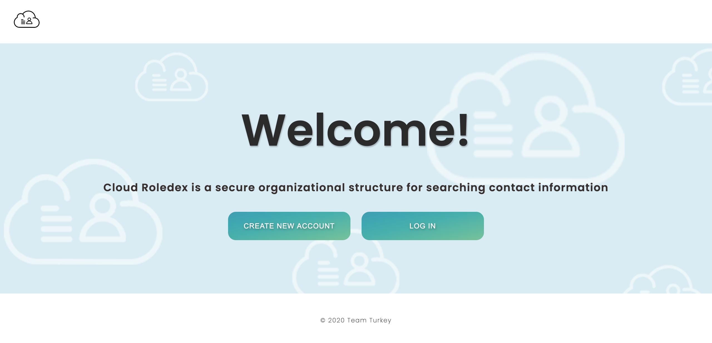
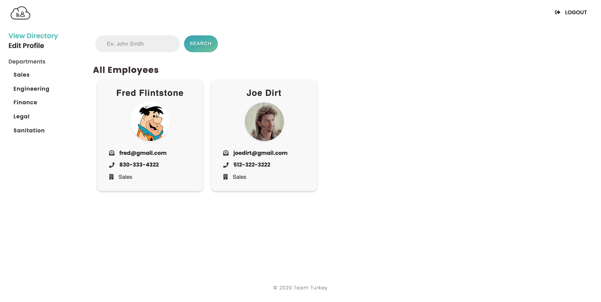
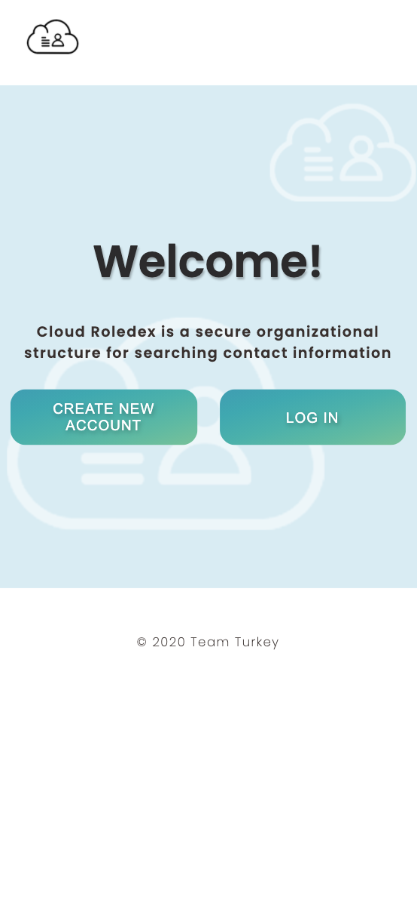
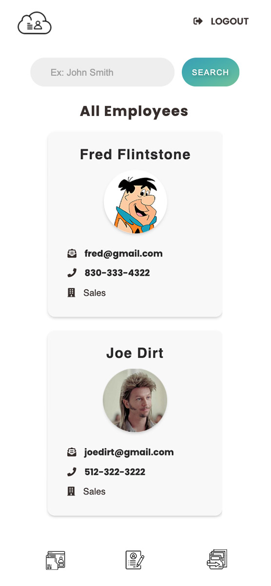

# Cloud Rolodex

## Description 
Employee Directory application.

## Screenshots
### Homepage

### Dashboard

### Mobile

  Mobile Homepage        |  Mobile Dashboard
 |  

### License
  MIT
### Contributing
Cloud Rolodex is an open source project, and anyone is encouraged to contribute by cloning or forking the code and working to improve its function and versatility.

Developers who worked on this project are: 

Seth Uschuk: 
https://github.com/suschuk24

Jeff Johnston: 
https://github.com/jeffwjohn

Octavio Garcia:
https://github.com/octaviusg
